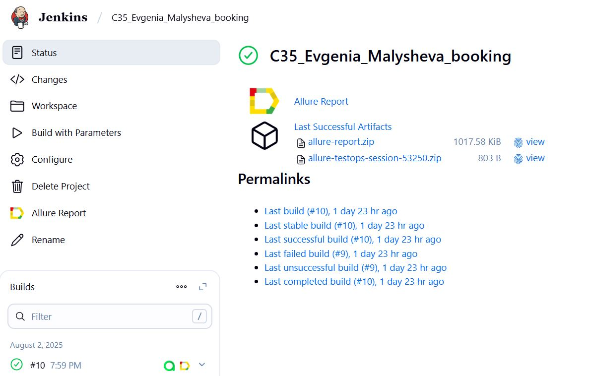
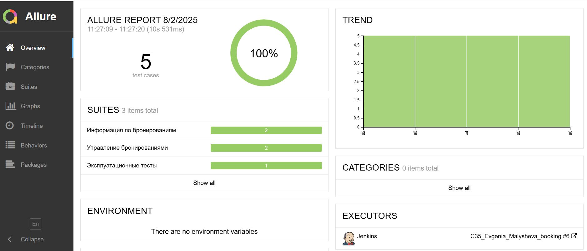
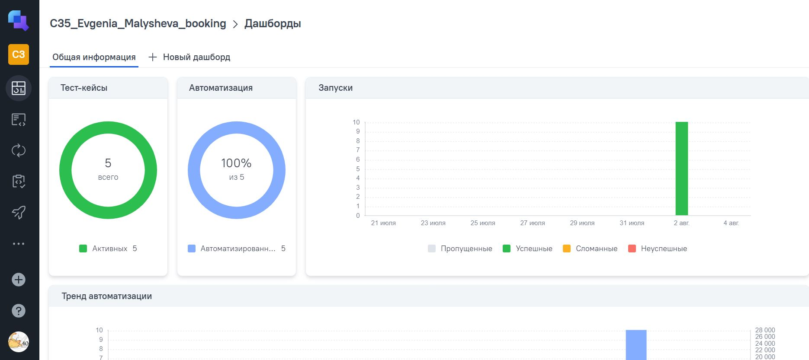
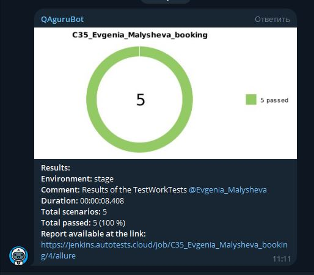

<a href="https://restful-booker.herokuapp.com/apidoc/index.html">  
<h2>Проект по автоматизации тестирования API для <a href="https://restful-booker.herokuapp.com/apidoc/index.html">api-Booking</a></h2>
Restful Booker API - это тренажёр API, основанный на процессах бронирования отелей. Поддерживает все основные CRUD-операции.

## ☑️ Содержание:

- Технологии и инструменты
- Список проверок, реализованных в тестах
- Запуск тестов (сборка в Jenkins) и из терминала
- Allure отчет
- AllureTestOps дашборд
- Уведомление в Telegram о результатах прогона тестов

<a id="tools"></a>
## :ballot_box_with_check:Технологии и инструменты:

|         Java                                                                                                      | IntelliJ  <br>  Idea                                                                                               | GitHub                                                                                                     | JUnit 5                                                                                                           | Gradle                                                                                                     | Rest <br> Assured                                                                                                     | Allure <br> Report                                                                                                         | Allure <br> TestOps                                                                                                         |  Jenkins                                                                                                        |   Telegram
|:----------------------------------------------------------------------------------------------------------|--------------------------------------------------------------------------------------------------------------------|--------------------------------------------------------------------------------------------------------------------|------------------------------------------------------------------------------------------------------------|-------------------------------------------------------------------------------------------------------------------|------------------------------------------------------------------------------------------------------------|----------------------------------------------------------------------------------------------------------------------------|----------------------------------------------------------------------------------------------------------------------------|-----------------------------------------------------------------------------------------------------------------|---------------------------------------------------------------------------------------------------------------------|
| <a href="https://www.java.com/"></a>  | <a href="https://www.jetbrains.com/idea/"></a> | <a href="https://github.com/"></a> | <a href="https://junit.org/junit5/"></a> | <a href="https://gradle.org/"></a>| <a href="https://rest-assured.io/"></a> | <a href="https://github.com/allure-framework"></a> | <a href="https://qameta.io/"></a> |<a href="https://www.jenkins.io/"></a> | <a href="https://web.telegram.org/"></a> |

<a id="cases"></a>
## :ballot_box_with_check: Реализованные проверки:
Реализованные API-тесты:
- Запрос списка всех бронирований
- Запрос подробной информации по одному бронированию
- Создание нового бронирования
- Удаление  бронирования
- Проверка работоспособности (ping) сервиса
____
##  Сборка в [Jenkins](https://jenkins.autotests.cloud/job/C35_Evgenia_Malysheva_booking/)
Jenkins — удобный инструмент для автоматизации сборки, тестирования и развёртывания ПО.

<p align="center">  
</a>  
</p>


### :ballot_box_with_check: Параметры сборки в Jenkins:

- login
- password
- baseURI (по умолчанию установлен адрес [api-Booking](https://restful-booker.herokuapp.com/apidoc/index.html))


### Команда для запуска из терминала
Локальный запуск
```bash
gradle clean test
```
Удаленный запуск через Jenkins:
```bash  
clean
test
"-Dlogin=${LOGIN}"
"-Dpassword=${PASSWORD}"
"-DbaseURI=${BASE_URI}"
```
____
## </a>  <a name="Allure"></a>Allure [Report](https://jenkins.autotests.cloud/job/C35_Evgenia_Malysheva_booking/allure/)	</a>
Allure Report - это инструмент для генерации и представления отчетов о результатах автоматизированного тестирования.
Тут можно быстро оценить результаты тестового прогона, посмотреть на шаги теста и пробежаться по приложенным аттачам (скрины, логи, видео и т.п.)

### Основная страница отчёта

<p align="center">  
  
</p>  

____
## </a>  <a name="AllureTestOps"></a>Allure [TestOps](https://allure.autotests.cloud/project/4853)	</a>
Allure TestOps — это мощный инструмент для управления тестированием, который помогает автоматизировать и оптимизировать процессы тестирования.
Здесь смотрим, контролируем, управляем, все показываем менеджеру и коллегам

### Основная страница отчёта

<p align="center">  
  
</p>  

____
## </a> Уведомление в Telegram при помощи бота
О - оперативность. После окончания тестового прогона сразу получаем нотификацию в Телеграм с результатами

<p align="center">  
  
</p>

